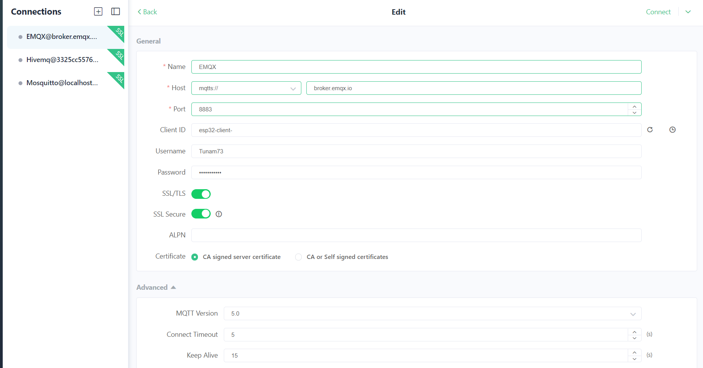
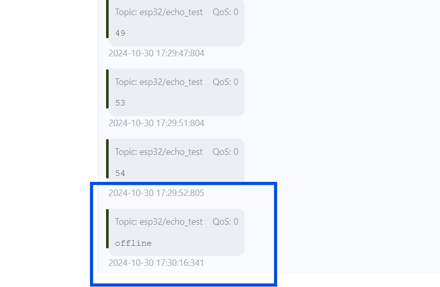

## Bố trí thí nghiệm 
- Dùng thư viện PubSubClient trên ESP32 kết nối với MQTT Broker EMQTX.
- Sử dụng thư viện Ticker, một thư viện chuẩn trong Arduino để gọi hàm publish một cách đều đặn và bất đồng bộ, mỗi giây (1s) một lần:
    + Mã: `mqttPulishTicker.attach(1, mqttPublish)`
    + Tài liệu về Ticker: https://docs.arduino.cc/libraries/ticker/, https://github.com/espressif/arduino-esp32/blob/master/libraries/Ticker/src/Ticker.h 
- Subscribe tới topic `esp32/echo_test` ngay sau khi MQTT connect thành công
- Gọi hàm `mqttClient.loop()` trong main loop để handle các thông điệp nhận được từ broker (bất đồng bộ, event driven) bất kỳ lúc nào. 
- Phát hiện mất kết nối MQTT `if (!mqttClient.connected())` trong main loop để kết nối lại `mqttReconnect()` ngay khi phát hiện mất kết nối.
- Khi client bị mất kết nối đột ngột, sau khoảng 20s sẽ nhận thông báo "offline" về topic; khi client được kết nối sẽ có thông báo "online"

## Kịch bản thí nghiệm
- Sau khi ESP32 khởi động, sẽ kết nối WiFi vào một điểm phát AP đã định (ssid, và pass trong secrets/wifi.h) --> thành công
- Sẽ thấy MQTT Client kết nối đến broker thành công và bắt đầu gửi (publish) và nhận (subscribe) số đếm tăng dần trong `echo_topic` đều đặn
- Khi đó sẽ tiến hành ngắt điểm phát WiFi, tiện nhất là phát wifi từ điện thoại để bật ngắt nó nhanh chóng trong tầm tay
- Quan sát phản ứng của MQTT Client trong mã khi mất kết nối WiFi giữa chừng
- Quan sát thông báo gửi về Last Will Topic khi client bị ngắt kết nối đột ngột
- Sau đó bật lại điểm phát WiFi và quan sát khả năng khôi phục kết nối, và quan sát việc mất gói tin trong quá trình kết nối.

## Mục đích 
- Xem việc ngắt kết nối từ bên dưới chồng Internet Protocol có ảnh hưởng tới lớp trên không. Ở đây là lớp WiFi (link layer) bị ngắt --> lớp TCP/IP bị ngắt --> có ảnh hưởng tới lớp ứng dụng MQTT trên cùng hay không? ESP core lib sẽ in ra thông điệp lỗi như nào (có báo lỗi từ lớp dưới lên lớp bên trên hay không?)
- Quan sát sự bỏ mặc việc mất thông điệp trong QoS = 0. 
- Hiểu rõ hơn về cơ chế hoạt động của MQTT client bên trên tầng TCP/IP, nhất là cơ chế phát hiện mất kết nối và khôi phục kết nối ở lớp vật lý, rất hay xảy ra trong thực tế.
- Làm thử nghiệm để hiểu chức năng của Last Will and Testament (LWT)

## Kết quả
(Do đây là thử nghiệm với LWT nên chỉ tập trung vào kết quả thu được từ LWT)
1. Tiến hành thiết lập kết nối với Broker EMQTX
- Sử dụng MQTTX để quan sát dữ liệu được gửi tới topic esp32/echo_test
    + Cấu hình cho MQTTX (**Hình 1**)
    
    **Hình 1**

- Sau khi kết nối, trạng thái của esp (online/offline) sẽ được hiển thị trước khi dữ liệu bắt đầu nhận
    
    **Hình 2**
    + **Hình 2** cho thấy: có ba thông điệp được "publish" là 0, 1, 2 trước cả khi MQTT kết nối thành công
    + Sau khi kết nối WiFi thành công, thì `Attempting MQTT connection...` mất khoảng 3s để thiết lập kết nối (mỗi lần publish là 1s).

2. Khi ngắt kết nối mạng của esp32
- Sau khoảng thời gian ~20s (keepALive + socketTimeout), Last Will message "offline" sẽ được gửi tới Last Will topic (ở đây tôi dùng last will topic trùng với echo_topic cho dễ quan sát) (**Hình 3**)

    **Hình 3**
- Khi kết nối lại mạng của esp32, thông báo "online" sẽ được gửi tới trước khi dữ liệu tiếp tục nhận được (**Hình 4**). 

    **Hình 4**
3. Cơ chế Echo hoạt động bình thường như dự kiến, kể cả với QoS 0: không quan sát thấy bị mất gói tin lần nào kể cả việc publish và subscribe với QoS = 0. 

## Kết luận 
- Kết quả này khẳng định Broker EMQTX hoạt động đúng như kỳ vọng trong việc duy trì trạng thái và độ tin cậy của hệ thống MQTT, đáp ứng các yêu cầu giám sát trạng thái cho các ứng dụng IoT.
- Thí nghiệm đã minh chứng khả năng hoạt động hiệu quả của Last Will and Testament (LWT) trong việc giám sát trạng thái của client thông qua broker EMQTX. 
- Với các cấu hình keepAlive và socketTimeout, hệ thống đảm bảo rằng trạng thái kết nối của ESP32 (online/offline) luôn được cập nhật chính xác trên topic theo thời gian thực.

